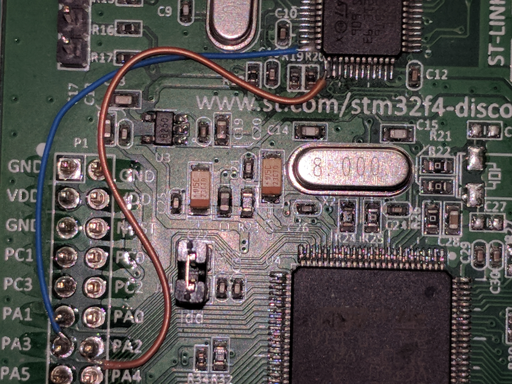

## unityController

Attach the UART2 pins PA2 and PA3 to the STLink processor.
Anything you send out UART2 in your code will show on the virtual com port on th STLINK.

The following describes the components that make up the protocol:
The ARM will send the following packet once each time interval.

Default time interval 0.1 second. The packet will be ASCII values.   

The start of packet is 3 # signs:					###

The next 3 Packet Number:					000 to 999 

The next 4 characters are the X accelerometer value:	0000 to FFFF

The next 4 characters are the Y	accelerometer value:	0000 to FFFF

The next 4 characters are the Z accelerometer value:	0000 to FFFF

The next 4 characters are the analog ch1 value:		0000 to 4095

The next 4 characters are the analog ch11 value:		0000 to 4095

The next 4 characters are the analog ch12 value:		0000 to 4095

The next 8 characters are for the input state of the I/O	00000000 to 11111111

Input pins (PD7,PB5,PB4,PB8,PE2,PE5,PE4,PC13)

The blue button (PA0)						0 to 1

The next three characters are the checksum:		000 to 999

The next 2 characters are \r\n					\r\n

The GUI can send the following to the ARM at any time you require for you project. The packet will be ASCII values.

The start of packet is 3 # signs:					###

The next 8 characters are for the output state of the I/O	00000000 to 11111111

Output pins (PD11,PD10,PD9,PD8,PB15,PB14,PB13,PB12)

The on board LEDs Blue, Red, Orange, and Green		0000 to 1111

The last three characters are the checksum:			000 to 999
